 

&ensp;
&ensp;
&ensp;

 

> self-taught dev, founder of [PellTech](https://pelltech.ca).

 

---

## `// what i've built` the ones that work, anyway

 

<table>
<tr>

<td width="50%" valign="top">

### [Pwnagotchi Companion](https://github.com/BraedenP232/PwnIOS)

iOS companion app for the [Pwnagotchi](https://pwnagotchi.ai) Wi-Fi auditing device. Full SwiftUI with real-time WebSocket data and Core Bluetooth over Raspberry Pi Zero W. Built this because the web UI was alright, but I wanted it better (and on my phone).

> ★ 5.0 &ensp;·&ensp; 300+ downloads &ensp;·&ensp; $2.2K revenue &ensp;·&ensp; still shocked

</td>

<td width="50%" valign="top">

### [HealthCheckerr](https://github.com/BraedenP232/HealthCheckerr)

Native iOS app for monitoring and controlling multiple Docker instances remotely. Check container health, read logs, and restart things without finding a laptop. Zero third-party services — just your phone talking directly to your server.

> native iOS &ensp;·&ensp; zero cloud &ensp;·&ensp; open source

</td>

</tr>
<tr><td colspan="2"> </td></tr>
<tr>

<td width="50%" valign="top">

### [trakt-json-converter](https://github.com/BraedenP232/trakt-json-converter)

Converts Trakt export files into the correct format for re-importing. I needed this, it didn't exist, so i made it in a couple hours. Five people starred it which is honestly five more than i expected.

> does one thing &ensp;·&ensp; does it well &ensp;·&ensp; ship it

</td>

<td width="50%" valign="top">

### [KITT Voice Assistant](https://github.com/BraedenP232/kitt_robot)

Voice assistant on Raspberry Pi 4 and ReSpeaker 4-mic array using Picovoice, Rhino Speech-to-intent, and Porcupine for wake-word and intent recognition. Responds with respective and contextual sound clips of KITT (Knight-Industries-Two-Thousand sentient car) from the Knight Rider TV Show. Runs entirely locally — no Alexa, no cloud.

> 100% local &ensp;·&ensp; custom wake-word &ensp;·&ensp; very cool actually

</td>

</tr>
</table>

 

---

## `// stack` things i use / things that broke / same thing

 

**iOS**&ensp;

 

**web**&ensp;

 

**backend · hardware · chaos**&ensp;

 

---

## `// stats` proof something happened

 

 

---

© 2026 · <a href="https://pelltech.ca">PellTech</a> · Calgary, AB · yarr ye' scurvy dog 🏴‍☠️

